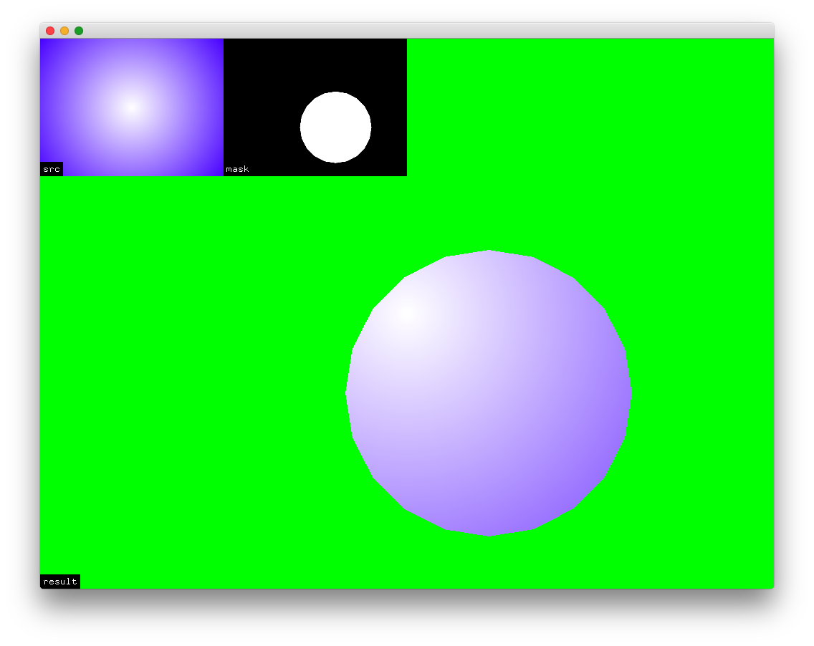

ofxAlphaMask
================
  
Simple alpha masking addon.  
  
  
# Usage

ofApp.h
```
ofxAlphaMask alphamask;
ofFbo        srcFbo;
ofFbo        maskFbo;
```

ofApp.cpp
```
alphamask.begin( maskFbo.getTexture() );
ofSetColor(255);
srcFbo.draw(0, 0);
alphamask.end();
```
